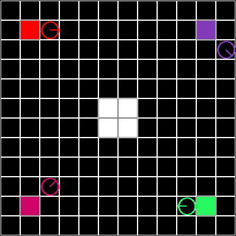
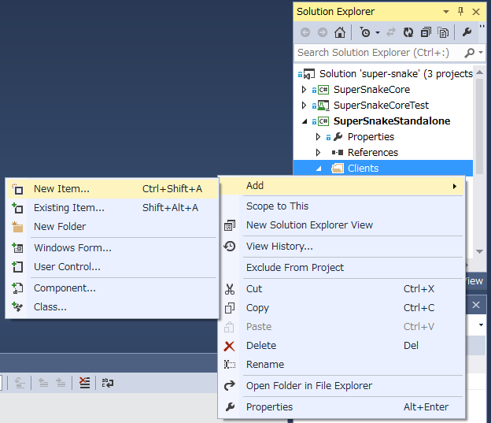

H27 部内プロコン(SuperSnake)ルール

# H27 部内プロコン(SuperSnake)ルール

## 概要

対戦型パズルゲーム「SuperSnake」のAIを作って対戦します。ゲームは「ステップ」を単位としてターン制で進行します。

## 用語など

### フィールド(field)
* ゲームが行われる2次元格子状の領域です。
* フィールドには幅(width)・高さ(height)があります。それぞれ2以上255以下の整数です。
* ゲームの進行には影響しませんが、フィールドには名前があります。

### セル(cell)
* フィールド上の1マスです。
* セルには通行可能(passable)なものとそうでないものがあります。
* ゲームの進行に伴い、通行可能だったセルが通行可能でなくなることもあります。始めから通行可能でないセルもありえます。
* ゲームの進行には影響しませんが、セルには色があります。

### プレイヤー(player)
* フィールド上でゲームを行うキャラクターです。
* プレイヤーには位置、向き、生死があります。
* ゲームの進行には影響しませんが、各プレイヤーには一意なプレイヤー番号(player number)が割り当てられます。プレイヤー番号は0以上プレイヤー数未満の整数です。
* ゲームの進行には影響しませんが、プレイヤーには名前と色があります。

### 位置(position)
* フィールド内外の座標です。(x, y)で表します。
* フィールドの左上のセルを(0, 0)とし、xの正の方向を右、yの正の方向を下とします。例えば、プレイヤーが(0, 0)から左に移動した場合の位置は(-1, 0)となります。

### 向き(direction)
* プレイヤーの向きです。
* 右(right)、右上(right up)、上(up)、左上(left up)、左(left)、左下(left down)、下(down)、右下(right down)の8種類があります。

### 生死(alive/dead)
* プレイヤーが生きている(alive)か死んでいる(dead)かです。
* 死んでいるプレイヤーは操作できません。

### セルの状態(cell state)
* セルの名前と色を合わせたものです。

### フィールドの状態(field state)
* フィールドの名前と幅、高さ、フィールド上のすべてのセルの状態を合わせたものです。

### プレイヤーの状態(player state)
* プレイヤー番号とプレイヤーの名前、色、位置、向き、生死を合わせたものです。

### ゲームの状態(game state)
* フィールドの状態とすべてのプレイヤーの状態を合わせたものです。

### ステップ(step)
* サーバーがプレイヤーの行動を基にゲームを進行すること、およびそのタイミングを1とする単位です。
* 詳細は「ゲームの進行」をご覧ください。

### 行動(action)
* 生きているプレイヤーの1ステップ後の状態を決定する情報です。
* 直進(straight)、右折(right turn)、左折(left turn)の3種類があります。
* 詳細は「ゲームの進行」をご覧ください。

### サーバー(server)
* ゲームの進行処理を行うシステムです。
* サーバーという用語になっていますが、今回はネットワークを介さずに1つのPCで実施する予定です。

### クライアント(client)
* 各プレイヤーの行動を決定する処理を行うシステムです。
* 今回の部内プロコン参加者が作成する部分です。

## ゲームの進行

このゲームの進行は1ステップごとに行われます。
ゲームの流れは以下のようになります。

1. サーバーがクライアントの参加を受け付けます。この時、各クライアントに対応するプレイヤーが割り当てられます。
2. サーバーがすべてのプレイヤーについて、プレイヤーの位置のセルを通行可能でなくします。
3. サーバーから各クライアントへゲームの状態が送信されます。
4. クライアントがゲームの状態を基に割り当てられたプレイヤーの行動を決定して、サーバーに行動を送信します。
5. サーバーがすべてのクライアントからの行動を受信するか、決められたタイムアウト時間に達したら、サーバーはゲームのステップ処理を行います。
6. ゲームが終了していなければ2.に戻ります。

サーバーで行われるステップ処理の内容は以下のとおりです。

1. （移動フェーズ）生きているすべてのプレイヤーについて、
    1. プレイヤーの行動に応じてプレイヤーの向きを変えます。直進ならそのまま、右折なら右に45度回転、左折なら左に45度回転です。
    2. プレイヤーの向いている方向にプレイヤーの位置を1つ移動します。
2. （死亡判定フェーズ）生きているすべてのプレイヤーについて、以下のいずれかの条件を満たすときそのプレイヤーは死亡します。 
    * プレイヤーの位置がフィールド外
    * プレイヤーの位置のセルが通行不可能
    * 同じ位置に他のプレイヤー（生死を問わない）がいる
3. すべてのプレイヤー（生死を問わない）について、プレイヤーの位置のセルを通行可能でなくします。

ゲームの終了条件は、以下のいずれかの条件を満たすことです。

* プレイヤーが1人以外全員死亡
* プレイヤーが全員死亡

## 順位

より長く生き残ったほうが上位となります。同時に死亡した場合は同順位となります。

## クライアントの作成

### クラスの作成手順(SuperSnakeStandalone)

1. プロジェクトを開く
    1. コマンドプロンプトでソースコードを取得したいフォルダに移動します。
    2.  以下のコマンドを入力してソースコードを取得します。
        * ` git clone https://github.com/a1502020/super-snake.git `
    3. 取得したフォルダ内の「super-snake.sln」を開きます。
        * Visual Studio が起動します。
2. クラスを追加する
    1. ソリューションエクスプローラー上で「SuperSnakeStandalone」内の「Clients」を右クリックし [Add] → [New Item] をクリックします。
        * 日本語では [追加] → [新しい項目] ？
        * 
    2. C#のクラスを選択し、適当なクラス名を入力してクラスを追加します。
        * 以下のサンプルコードでは、このクラス名を`SampleClient`として説明する。
    3. 作成したクラスが、クラス`Client`を継承するようにします。
        * `public class SampleClient : Client`
3. AIを実装する
    1. 抽象メソッド`Think`を作成します。
        * `public override Action Think(GameState gameState, int myPlayerNum)`
        * `public override`まで書けば IntelliSenseが自動で入力してくれます。
        * `Action`という名前が`System.Action`と被っているため、ファイル先頭のusingに`using Action = SuperSnake.Core.Action;`を追加すると良いです。
    2. `Think`の内容としてAIを実装します。
        * `Think`は「ゲームの状態」と自分の「プレイヤー番号」を受け取り、「行動」を返すメソッドです。
4. デバッグ
    * （準備中）

### ゲームの状態のアクセス方法

* `gameState` : ゲームの状態（`Think`の第1引数）
    * `gameState.Field` : フィールドの状態（以下`field`）
        * `field.Width` : フィールドの幅
        * `field.Height` : フィールドの高さ
        * `field.Cells[x][y]` : 位置`(x, y)`のセルの状態（以下`cell`）
            * `cell.Passable` : セルが通行可能か否か
    * `gameState.Players[i]` : プレイヤー番号`i`のプレイヤーの状態（以下`player`）
        * `player.Position` : プレイヤーの位置（以下`position`）
            * `position.X` : X座標
            * `position.Y` : Y座標
        * `player.Direction` : プレイヤーの向き（以下`direction`）
            * `direction.Value` : 以下の8つの値のいずれか
                * `Direction.Right`
                * `Direction.RightUp`
                * `Direction.Up`
                * `Direction.LeftUp`
                * `Direction.Left`
                * `Direction.LeftDown`
                * `Direction.Down`
                * `Direction.RightDown`
        * `player.Alive` : プレイヤーが生きているか否か
        * `player.Dead` : プレイヤーが死んでいるか否か
* `myPlayerNum` : 自分のプレイヤー番号（`Think`の第2引数）

### 補助メソッド等

* `PositionState GetNextPosition(PositionState pos, DirectionState dir)`
    * 位置と向きを渡すと、その位置からその向きに1つ進んだ位置を返します。
* `DirectionState GetLeft(DirectionState dir)`
    * 向きを渡すと、その向きから左に45度回転した向きを返します。
* `DirectionState GetRight(DirectionState dir)`
    * 向きを渡すと、その向きから右に45度回転した向きを返します。
* `bool IsIn(FieldState field, PositionState pos)`
    * フィールドと位置を渡すと、その位置がフィールド内にあるか否かを返します。
* `Random rnd`
    * 乱数を生成できます。
    * `rnd.Next(3)`とすれば、`0`、`1`、`2`のいずれかの値が返されます。
* あったほうが良さそうなものがあれば追加します。もしくはプルリクください。

### AI実装のためのポイント

* `RansuchanClient`を参考にしてください。
* 無限ループに陥らないように注意してください。
* フィールドの範囲外の位置のセルにアクセスするなどして、例外が発生しないように注意してください。
